<p align="center">
  
</p>

<h3 align="center">
Linkify is currently a school management system for Lego Spike, Arduino, and Raspberry Pi equipment. This system allows users to send loan requests for the mentioned equipment to one or multiple users. It includes entering the box number, the delivery date, the user's account number, the user's email address, and the user's full name. The loans are recorded and displayed to the administrator, who can also terminate the loan at any time.
</h3>

<h2 align="center">🚀Development technologies🧑‍💻</h2>

<p align="center">
  <a href="https://skillicons.dev">
    
  </a>
</p>

<h2 align="center">⚙️Features🛠️</h2>

<li>Management and Request of Lego Spike Education Equipment.</li>
<li>Management and Request of Raspberry Pi Equipment.</li>
<li>Management and Request of Arduino Equipment.</li>
<li>Generation of .docx Documents for Requests (Loan Agreement).</li>
<li>Sending Loan Agreement via Email to the System Administrator.</li>
<li>Sending Loan Agreement via Email to Users Entered in the System.</li>
<li>Viewing Active and Completed Loans.</li>
<br>

> [!NOTE]
> The project is currently on Railway (development), receiving constant updates for optimization, bug fixes, and improvements. More features are planned, such as library management, control loan management, and laptop loan management.

<h2 align="center">🏁Goals🏁</h2>

<li><strong>Optimize Resource Management:</strong> Facilitate the process of borrowing and returning equipment such as Lego Spike, Arduino, and Raspberry Pi, ensuring that resources are available and in good condition for students and staff.</li>
<li><strong>Improve Administrative Efficiency:</strong> Automate the generation of documents and email communication to reduce administrative workload and ensure that all relevant information is efficiently managed and properly recorded.</li>
<li><strong>Ensure Transparency and Control:</strong> Provide clear visibility of active and completed loans for both administrators and users, ensuring proper tracking and minimizing losses or misuse of equipment.</li>
<li><strong>Expand Functionalities:</strong> Enhance the system's capabilities to include library management, as well as the loan management of controllers and laptops, offering a comprehensive solution for resource management.</li>
<li><strong>Promote Educational Innovation:</strong> Support the integration of new technologies and teaching methods through the availability and easy management of equipment, encouraging innovation in the educational process.</li>
<br>

> [!IMPORTANT]
> It is important to mention that the project is currently implemented and tested in a preparatory school.

<h2 align="center">🔄️Upcoming updates🔄️</h2>

<li>Library management.📚</li>
<li>Control loan management.💻</li>
<li>Laptop loan management.📱</li>

<h2 align="center">Project Setup</h2>

### Clone Repository

<p>To use this project locally, it is necessary to execute the following commands in your favorite code editor's terminal.</p>

- `git clone https://github.com/EricV29/Linkify.git`

### Install

```bash
$ npm install
```

### Development

```bash
$ npm run dev
```

### Build

```bash
# For windows
$ npm run build:win

# For macOS
$ npm run build:mac

# For Linux
$ npm run build:linux
```

<h2 align="center">🖥️Interfaces🖥️</h2>

|                                         |                                         |
| --------------------------------------- | --------------------------------------- |
| Login: Enter username and password | Welcome: Includes logo, version, and managed tools. |
| 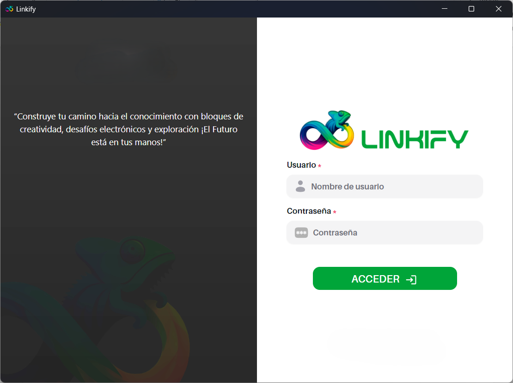 | 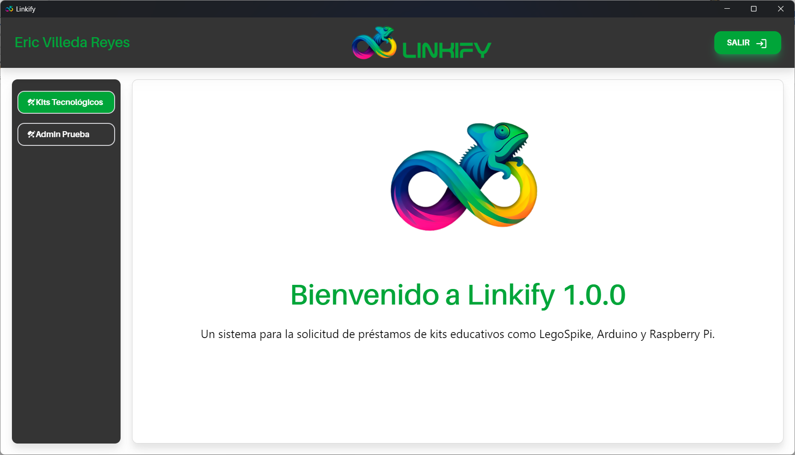 |
| Menu: Includes sidebar with the different functions of the system, navbar with the name and a button to exit the system and main space to show what the functions include. | Lego Spike Requests: It includes a form to add users to a team, box selection, delivery date, account number (in this case, students), email address (in this case, institutional), full name, button to add users, table with the list of added users, and button to submit the request. |
| 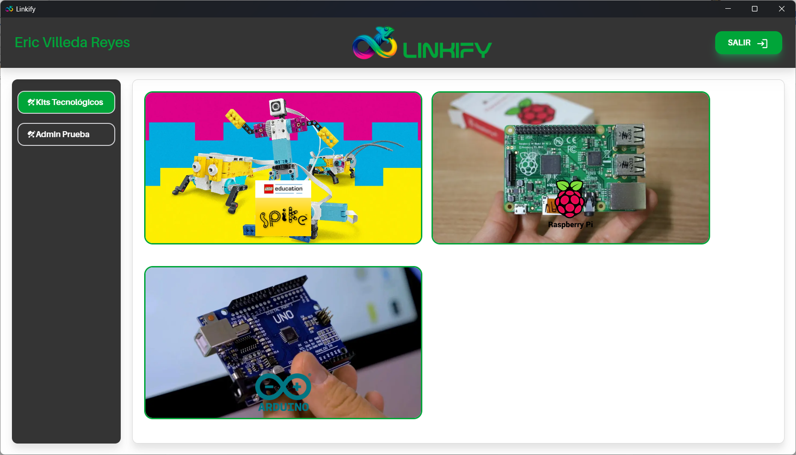 | 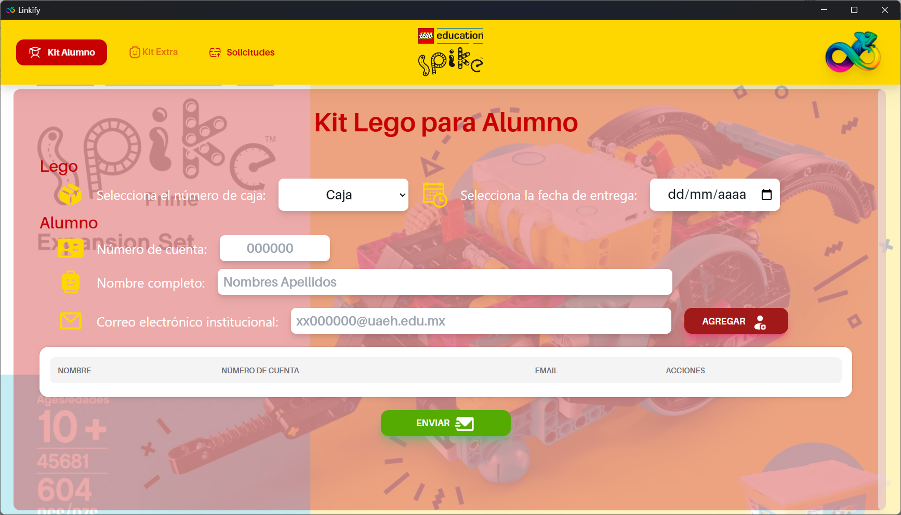 |
| Aurduino Requests: It includes a form to add users to a team, box selection, delivery date, account number (in this case, students), email address (in this case, institutional), full name, button to add users, table with the list of added users, and button to submit the request. | Raspberry Requests: It includes a form to add users to a team, box selection, delivery date, account number (in this case, students), email address (in this case, institutional), full name, button to add users, table with the list of added users, and button to submit the request. |
| 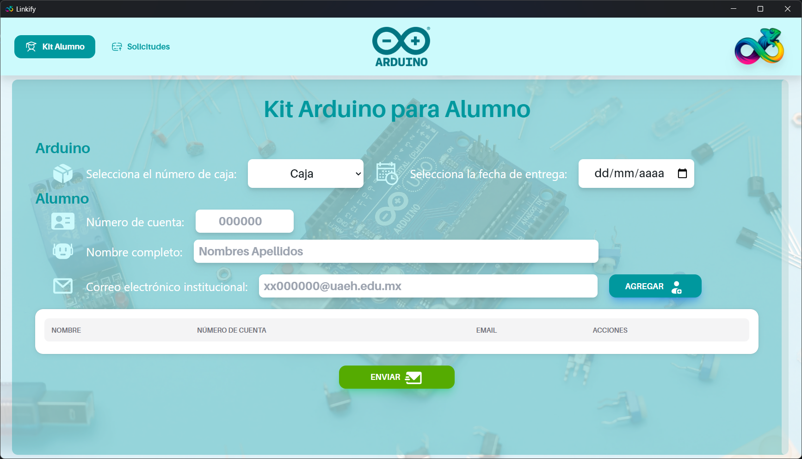 | 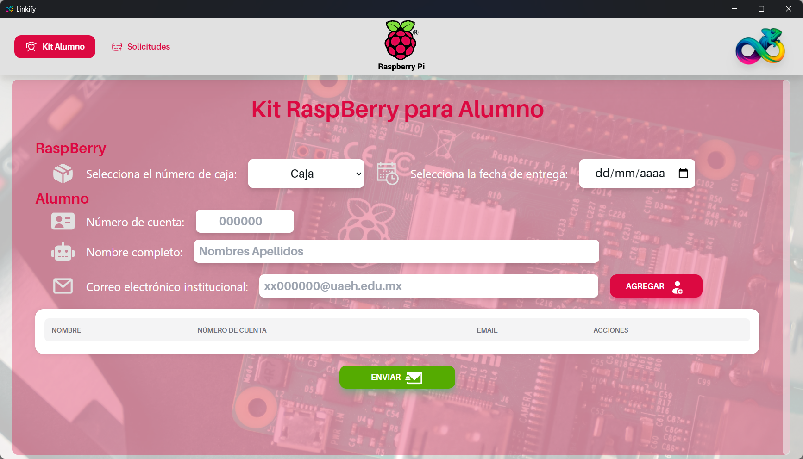 |
| Request history: Includes a switch to view active and completed requests. | Request history: Includes a switch to view active and completed requests. |
| 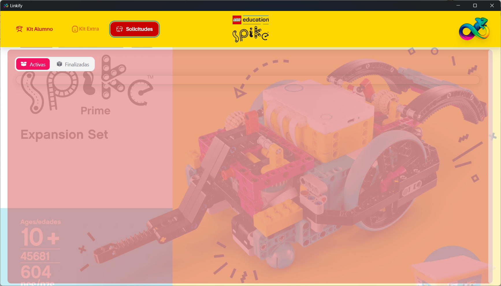 | 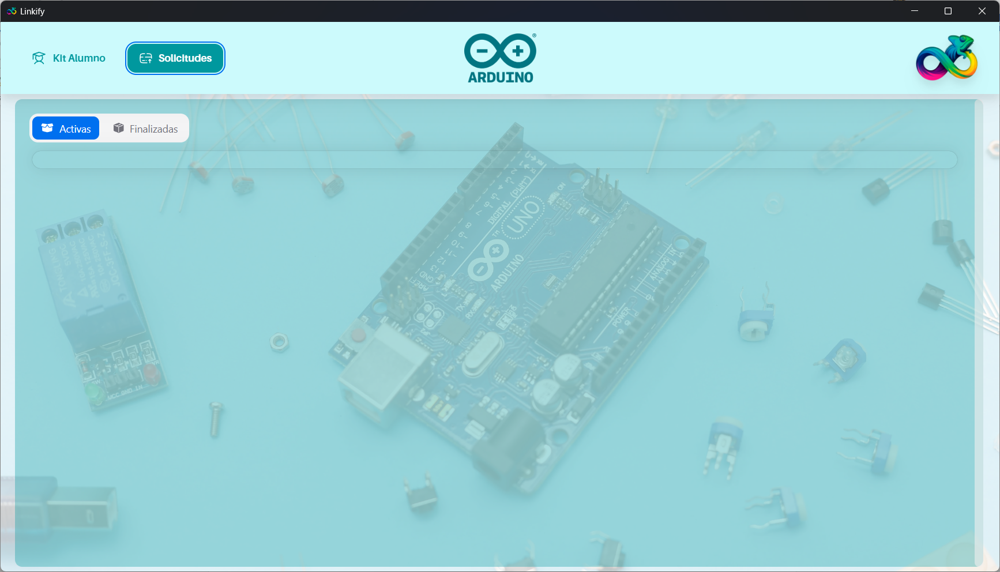 |
| Request history: Includes a switch to view active and completed requests. | Popover asks: Ask to confirm if you agree to send the request. |
| 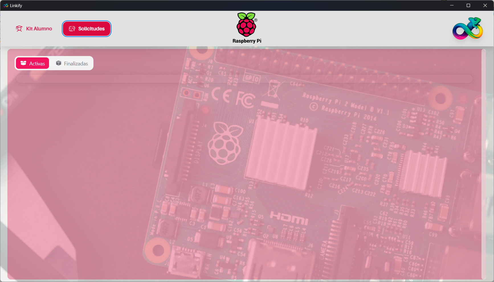 | 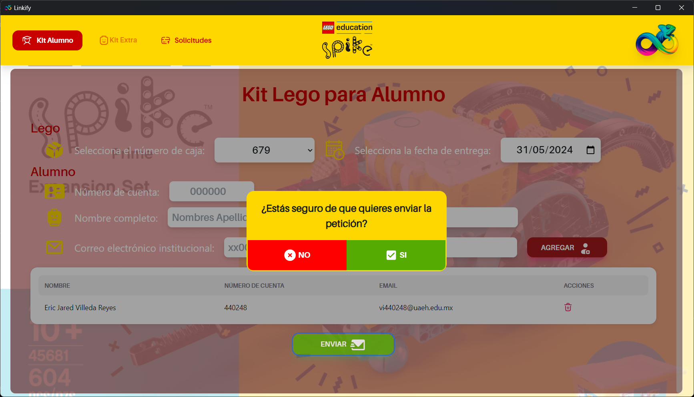 |
| Loading: When performing functions such as sending a request, sending emails, and loading request history, the loading screen will appear. |     |
| 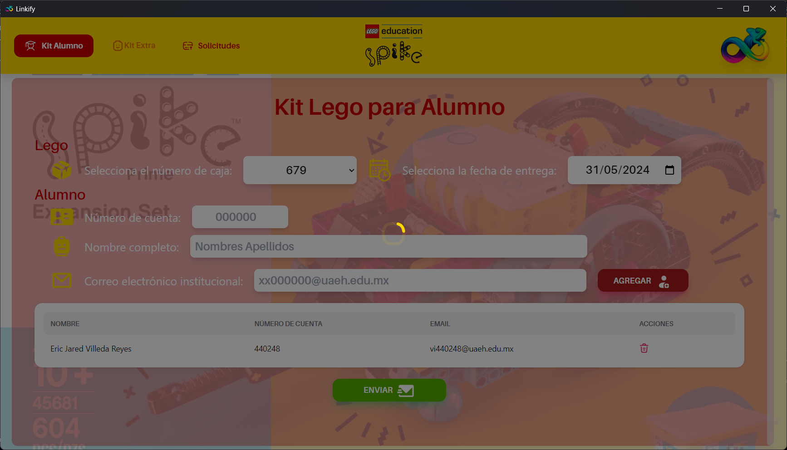 |  |

> > > > > > > (VERSION: Linkify 1.0.0)
